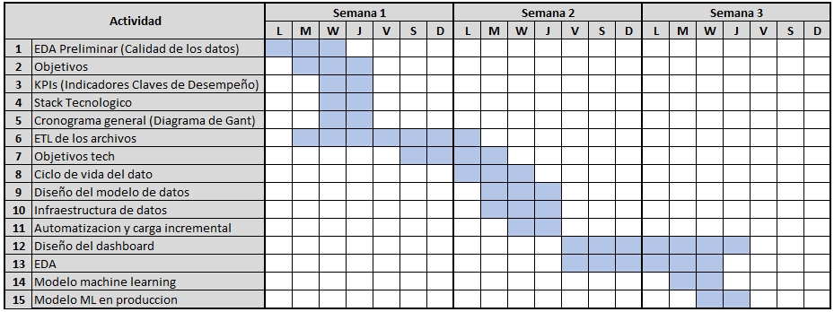
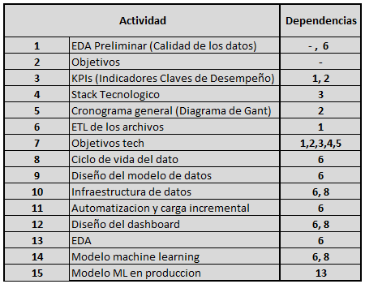

# Contexto

En la era digital, la opinión de los usuarios se ha convertido en un recurso invaluable que influye significativamente en las decisiones de compra y en la estrategia de negocios. Plataformas de reseñas como Yelp y Google Maps han dado a los consumidores la capacidad de compartir sus experiencias sobre una amplia variedad de negocios, desde restaurantes hasta hoteles y otros servicios relacionados con el turismo y el ocio. En este contexto, las empresas han reconocido la importancia de comprender y aprovechar esta información para mejorar sus servicios, tomar decisiones estratégicas y anticipar las tendencias del mercado.

- **Cliente:** Grupo empresarial con gran variedad de negocios en diferentes industrias
- **Problematica a resolver:** El cliente necesita encontrar enfoques efectivos para diferenciarse de sus competidores, con el fin de atraer y retener a una base de clientes sólida en un entorno empresarial altamente competitivo. Además, tiene la ambición de expandir su presencia hacia nuevos mercados, lo que implica la necesidad de identificar oportunidades estratégicas y adoptar estrategias de expansión efectivas. Por último, busca mejorar la fidelización de sus clientes actuales y al mismo tiempo aumentar su número.

# Entregables

### Informe
Documento que que tiene como objetivo proporcionar  información valiosa sobre las tendencias del mercado, la satisfacción de los clientes y las oportunidades de crecimiento en los diferentes rubros de negocio.

### Modelo de machine learning
Modelo de aprendizaje automatico que sera utilizado por el cliente para predecir el crecimiento de los diferentes rubros de negocio para ayudarlo a tomar decisiones informadas sobre a que tipo de negocio (rubro) puede invertir.

### Sistema de recomendacion
Sistema de recomendacion que sera utilizado por el cliente donde dado un tipo de negocio (rubro) este le devuelva los estados que tienen una mejor aceptacion del tipo de negocio.

## Cambio Entregables
Teniendo en cuenta el tiempo disponible para el desarrollo de los entregables y la complejidad de los mismos se habla con el cliente para entregar el sistema de recomendacion unicamente.

# Objetivos

## Objetivo General

Este proyecto tiene como objetivo proporcionar al cliente información valiosa que le ayude a tomar decisiones informadas sobre dónde invertir, cómo mejorar la satisfacción de los clientes y cómo aumentar las ventas por medio del aumento de nuevos clientes.

## Objetivos Específicos del Proyecto

- Generar un informe de análisis que identifique tendencias en el mercado, la satisfacción de los clientes y las oportunidades de crecimiento, con la finalidad de proporcionar al cliente una visión clara y fundamentada de la situación actual del negocio, el comportamiento del mercado, permitiéndoles tomar decisiones estratégicas informadas para mejorar la satisfacción de los clientes, identificar oportunidades de crecimiento y mantenerse al tanto de las tendencias del mercado
- Desarrollar un modelo de aprendizaje automático que pueda predecir el crecimiento de los rubros de negocios con el fin de proporcionar al cliente una herramienta precisa y eficaz para anticipar y planificar el crecimiento de sus diferentes rubros de negocios, permitiéndoles tomar decisiones estratégicas basadas en predicciones confiables y mejorando así su capacidad para aprovechar oportunidades y minimizar riesgos en un entorno empresarial dinámico.
- Implementar un sistema de recomendación  donde dado un tipo de negocio (rubro) este le devuelva los estados que tienen una mejor aceptacion del tipo de negocio con la finalidad de proporcionar a los clientes una herramienta que les permita identificar los estados o regiones que presentan una alta aceptación y demanda para un tipo de negocio específico. Esto ayudará a los usuarios a tomar decisiones informadas sobre la ubicación de su negocio o sus actividades de interés, maximizando así sus oportunidades de éxito y rentabilidad en función de la demanda local

# Stack tecnológico del proyecto

# KPIs

### KPI de Participación de Usuarios
**Descripción:** Se refiere al número promedio de consejos o recomendaciones que cada usuario aporta a lo largo de un período de tiempo específico en la plataforma. Este indicador es crucial para evaluar el nivel de involucramiento de los usuarios en la plataforma y su contribución a la comunidad. Una disminución en este valor podría indicar una menor participación de los usuarios y una posible disminución en el atractivo de la plataforma.

**Participacion de usuarios** = Numero total de reviews / Numero total de usuarios

**Objetivo:** Aumentar la participación de usuarios en un 10% cada año, lo que indicaría un crecimiento saludable de la comunidad.

**Función:** Este KPI sirve para medir la interacción y el compromiso de los usuarios en una plataforma de reseñas. Permite a las empresas y administradores de la plataforma evaluar la salud y la vitalidad de la comunidad de usuarios. Una alta participación de usuarios generalmente indica un alto nivel de satisfacción y compromiso con la plataforma, mientras que una disminución en este KPI puede señalar problemas que requieren atención.

### KPI de Proporción de Reseñas Negativas
**Descripción:** Se refiere a la proporción de reseñas negativas en comparación con el número total de reseñas de un negocio en una plataforma de reseñas, como Yelp o Google Maps. Las "reseñas negativas" se definen generalmente según una calificación específica (solo se tendra en cuenta la cantidad de estrellas, donde si la reseña tiene 1 o 2 estrellas esta se considera negativa). Esta métrica es esencial para evaluar la percepción general de los clientes sobre un negocio y su nivel de satisfacción. Una proporción baja de reseñas negativas suele ser un indicador de una alta satisfacción del cliente.

**Proporción de reseñas negativas** = Número total de reseñas negativas / Número total de reseñas

**Objetivo:** reducir la Proporción de Reseñas Negativas en un 5% cada año.

**Función:** Este KPI se utiliza para medir la satisfacción del cliente y la calidad del servicio ofrecido por un negocio. Proporciona información valiosa sobre la percepción de los clientes y ayuda a identificar problemas o áreas de mejora. Una proporción baja de reseñas negativas es indicativa de una experiencia positiva del cliente, mientras que una alta proporción de reseñas negativas puede señalar problemas que requieren atención.

### KPI de Proporción de Reseñas Positivas
**Descripción:** se refiere a la proporción de reseñas positivas en comparación con el número total de reseñas de un restaurante específico en una plataforma de reseñas. Las "reseñas positivas" pueden definirse según una calificación específica de estrellas (si la reseña tiene 4 o 5 estrellas se considera positiva). Esta métrica permite evaluar la percepción general de los clientes sobre el restaurante y su nivel de satisfacción. Un aumento en la proporción de reseñas positivas o su estabilidad indica una buena satisfacción del cliente.

**Proporción de reseñas positivas** = Número total de reseñas positivas / Número total de reseñas

**Objetivo:** Se espera que la Proporción de Reseñas Positivas aumente 5% estable cada año.

**Función:** Este KPI se utiliza para medir la satisfacción del cliente y la calidad del servicio ofrecido por un restaurante específico. Proporciona información valiosa sobre la percepción de los clientes y ayuda a identificar áreas en las que el restaurante puede estar haciendo un buen trabajo. Una proporción alta de reseñas positivas refleja una experiencia positiva del cliente.

### KPI de Tasa de Retención de Usuarios
**Descripción:** La Tasa de Retención de Usuarios es un indicador clave que mide la proporción de usuarios que continúan contribuyendo con consejos o recomendaciones en años posteriores en comparación con el año en que iniciaron su actividad en la plataforma. Esta métrica es esencial para evaluar la fidelización de los usuarios a lo largo del tiempo. Una disminución en la Tasa de Retención de Usuarios podría indicar una menor retención y participación de los usuarios en la plataforma.

**Fórmula:** Tasa de retención de usuarios = (Usuarios que contribuyeron en el año actual y en años posteriores) / (Número total de usuarios)

**Objetivo:** Aumentar en un 10% la Tasa de Retención de Usuarios cada año.

**Función:** La Tasa de Retención de Usuarios es crucial para evaluar la fidelización de los usuarios en una plataforma de recomendaciones. Proporciona información sobre cuántos usuarios continúan participando y contribuyendo con consejos a lo largo del tiempo. Esto es fundamental para entender la lealtad de los usuarios y su compromiso con la plataforma. Una Tasa de Retención de Usuarios saludable indica una fuerte retención y participación de la comunidad, mientras que una disminución en esta tasa puede ser una señal de que se deben tomar medidas para mejorar la retención de usuarios.

### KPI de Satisfacción de la Región
**Descripción:** El KPI de Satisfacción de la Región se basa en el análisis de sentimiento de las opiniones de los usuarios y clasifica estas opiniones por región. Para calcular este KPI, se asigna una puntuación de satisfacción a cada opinión en función de su sentimiento. Por ejemplo, se puede utilizar un sistema de puntuación de -1 (negativo) a +1 (positivo) para evaluar cada opinión. Luego, se calcula un promedio de estas puntuaciones para obtener la Puntuación de Satisfacción del Usuario para una región específica.

**Fórmula:** Crecimiento en Satisfacción = (Puntuación de Satisfacción del año actual - Puntuación de Satisfacción del año anterior) / (Número total de usuarios)

**Objetivo:** El objetivo es lograr un aumento del 5% en la satisfacción de los usuarios en la región por año.

**Función:** Este KPI tiene como objetivo evaluar la evolución de la satisfacción de los usuarios en una región específica a lo largo de un período de 5 años. Proporciona información clave sobre si la satisfacción del usuario está aumentando o disminuyendo con el tiempo. Una puntuación de satisfacción alta indica una satisfacción positiva de los usuarios, mientras que una puntuación baja sugiere una insatisfacción.

## Cambios Kpis
Se decide **eliminar los kpis de Tasa de Retención de Usuarios** debido a que el kpi no estaba acorde con la base de datos trabajada debido a que la base de datos no proporciona la cantidad de veces que un usuario va a un lugar, por lo que se procede a **agregar un nuevo kpi el cual sera el siguiente.**

### KPI de Negocios Abiertos
**Descripción:** El KPI de Negocios Abiertos se basa en el recuento de la cantidad de negocios abiertos de una determinada area de negocio.

**Fórmula:** Recuento de negocios abiertos (en funcionamiento)

**Objetivo:** El objetivo es visualizar si existe un aumento en un 10% de la cantidad de negocios abiertos por año.

**Función:** Este KPI tiene como objetivo evaluar la evolucion del mercado em la cual se quiere iniciar el negocio. Este proporciona informacion necesaria sobre la cantidad de negocios que continuan activos, lo cual nos ayuda a identificar si es viable abrir un negocio en un tipo de industria especifico. 

# Cronograma General
El cronograma general del proyecto se divide en tres semanas, con tareas distribuidas en un período de siete días para las 2 primeras semanas y para la tercera un período de 4 días teniendo en cuenta que la Demo se presenta el día viernes de esta misma. Cada semana se enfoca en etapas clave del proyecto, desde la definición de objetivos y selección de tecnologías en la primera semana, hasta la implementación de un modelo de machine learning y su despliegue en la tercera semana. Este cronograma proporciona una estructura detallada que guía el desarrollo del proyecto, asegurando que cada tarea se realice en el momento adecuado y se cumplan los plazos establecidos.

### Tabla de Dependencias de Tareas
A continuación, se presenta una tabla de dependencias de tareas para el proyecto de análisis de datos que has planteado. Esta tabla muestra cómo algunas tareas dependen de la finalización de otras tareas dentro del proyecto.

### Tareas Asignadas
Las tareas asignadas en un proyecto se distribuyen estratégicamente a medida que se avanza en el proyecto para garantizar una ejecución eficiente y eficaz. La distribución de tareas en la primera semana se realizó de la siguiente manera:
- En la primera semana del proyecto, se llevó a cabo la fase inicial de planificación y definición, lo que incluyó la elaboración del Planteo de Objetivos, la selección del Stack Tecnológico, la definición de KPIs (Indicadores Claves de Desempeño), la creación del Cronograma General (Diagrama de Gantt), el desarrollo del EDA preliminar y el avance del ETL.
- La asignación de tareas en esta etapa se realizó de la siguiente forma:
  - El planteamiento de objetivos, la selección del stack tecnológico y la definición de los KPIs se llevaron a cabo de manera colaborativa entre todos los miembros del equipo. Esto garantizó que se aprovecharan las perspectivas y conocimientos, permitiendo así tener una comprensión compartida y una visión clara del camino a seguir en el proyecto.
  - En la fase de Análisis Exploratorio de Datos (EDA), se adoptó un enfoque colaborativo donde los archivos se distribuyeron de manera equitativa entre los miembros del equipo. A medida que un miembro del equipo completaba su análisis de un conjunto de datos, se fomentaba la colaboración y el apoyo entre los miembros del equipo, de manera que aquellos que habían finalizado su tarea brindaban ayuda y orientación a los compañeros que estaban trabajando en otros conjuntos de datos. Esta dinámica de trabajo en equipo garantiza una distribución equitativa de la carga de trabajo y permitió un progreso eficiente en la realización del EDA.
  - Para el avance del proceso de Extracción, Transformación y Carga (ETL), cada miembro del equipo trabajó en los archivos que les fueron asignados durante el EDA. Donde se adoptó la misma metodología de colaboración y apoyo entre los miembros del equipo.
